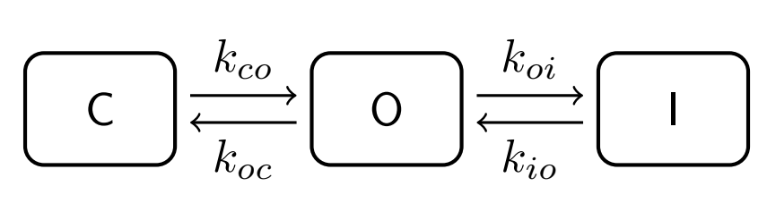

### Exercise 1: Gating equation with constant coefficients

We will solve the classic Hodgkin-Huxley gating equation, representing the activation ($\alpha$) and deactivation ($\beta$) processes:
$$ \frac{{\rm d}m}{{\rm d}t} = \alpha (1-m)-\beta m$$

**Exercise 1a)**

Find the equilibrium solution for this equation, i.e. solve $\frac{{\rm d}m}{{\rm d}t} = 0$.

In terms of channel biophysics, what is happening under this condition?

**Exercise 1b)**

Call the solution you found above $m_{\infty}$. For $\alpha$, $\beta>0$, find the set of values $m_{\infty}$ can have.

**Exercise 1c)**

The time constant of the equation is defined as $\tau_m=\frac{1}{\alpha+\beta}$.
Reformulate the ODE by using $m_{\infty}$ and $\tau_m$ instead of $\alpha$ and $\beta$.

**Exercise 1d)**

Use the widget below to find values for $\alpha$ and $\beta$ such that the solution quickly approaches 0.8.

```
import sys
import subprocess
subprocess.run([sys.executable, "-m", "pip", "install", "numpy", "matplotlib", "scipy"], stdout=subprocess.DEVNULL)
!{sys.executable} -m pip install numpy
!{sys.executable} -m pip install matplotlib
!{sys.executable} -m pip install scipy
```

```
import L4_code as L4
import importlib
importlib.reload(L4)
L4.GatingWidget();
```

**Exercise 1e)**

Can you verify analytically that you have found the fastest solution possible?

_Hint:_ Solve $m_{\infty}=0.8$ to express $\beta$ as function of $\alpha$. Insert this into the expression for $\tau_m$.

### Exercise 2: Voltage-dependent coefficients

We will now consider the case where the coefficients are not constants but some function of the membrane voltage. Specifically we will use the follwing exponential forms:

$$ \alpha(V) = e^{(V-V*\alpha)/d*\alpha}$$
$$ \beta(V) = e^{(V-V*\beta)/d*\beta}$$

**Exercise 2a)**

What are the values of $\alpha(V_\alpha)$, $\alpha(V_\alpha+d_\alpha)$ and $\alpha(V_\alpha-d_\alpha)$?

**Exercise 2b)**

Make a sketech of $\alpha(V)$, assume $d_\alpha>0$.

**Exercise 2c)**

Use the widget below to familiarize yourself with the impact of the parameters on $m_\infty(V)$ and $\tau_{m}(V)$.

- Find a paremeter set where $m_\infty(V)$ changes rapidly around $V=-50$.
- Keep $d_\alpha = -d_\beta$ and small (say 10). How does the peak of $\tau_m(V)$ depend on $V_\alpha$ and $V_\beta$?

```
importlib.reload(L4)
L4.voltage_dependence();
```

### Exercise 3: A two current model, with fixed conductances

We will study the following model that consits of two ionic currents, pluss an applied current.
$$C_{\rm m}\frac{{\rm d}V}{{\rm d}t} = - g_{\rm Na} (V-E_{\rm Na}) - g_{\rm K} (V-E_{\rm K}) + I_{\rm app}$$

Use the widget below to familiarize yourself with the impact of the parameters.

**Exercise 3a)**

- Set the initial value $V_0=-80$, and $g_{\rm{Na}}$ = $g_{\rm{K}}$ = 0. How large must I_amp be to reach -40mV?
- The model uses $C_m$ = 0.05nF and the applied current lasts for 1ms. Can you derive the required current strength from the mathematical model?

**Exercise 3b)**

- Increase $g_{\rm{K}}=0.2$ $\rm{\mu{}S}$. How large must the applied current be now to reach -40mV?

**Exercise 3c)**

- Set the applied current to zero. For $g_{\rm{K}}$ = 0.2uS, how large must $g_{\rm{Na}}$ be in order to for $V$ to reach 0mV?
- How dows the required value of $g_{\rm{Na}}$ depend on $V_0$?
- With $E_{\rm{K}}=-80mV$ and $g_{\rm{Na}}=50mV$ can you find the required value of $g_{\rm{Na}}$ mathematically?

```
importlib.reload(L4)
L4.ConstantConductancesWidget();
```

### Exercise 4: Voltage dependent conductance

We expand the model above with a voltage dependent gate $m$:

$$C_{\rm m}\frac{{\rm d}V}{{\rm d}t} = - g_{\rm Na} m (V-E_{\rm Na}) - g_{\rm K} (V-E_{\rm K}) - I_{\rm app}.$$
where $m$ is controlled by:
$$ \frac{{\rm d}m}{{\rm d}t} = \alpha_m (1-m)-\beta_m m$$

We use a parameterisation similar to above, but with $V_\alpha= V_\beta = V_s$ and $d_\alpha = -d_\beta = d$:

$$ \alpha(V) = e^{(V-V_s)/d}$$
$$ \beta(V) = e^{-(V-V_s)/d}$$

We will assume that $\alpha_m$ and $\beta_m$ are large such that we can use the approximation $m(t,V)\approx m_\infty(V)$.

Our model is then a single ODE instead of a system of two ODEs, but we are no longer able to solve it analytically due to the messy dependency of voltage in $m_\infty(V)$.

**Exercise 4a)**

- With the other parameters fixed ($V_0=-80,V_s = -20, d = 10$), how large must $I_{\rm amp}$ be for the voltage to surpass 0mV?

**Exercise 4b)**

- With the other parameters fixed ($I_{\rm amp}=0,V_s = -20, d = 10$), how large must $V_0$ be for the voltage to surpass 0mV?
- How is this releated to the I-V plot on the right?

**Exercise 4c)**

- With $I_{\rm amp}=0$ and $d = 10$, find a value for $V_s$ such that the threshold for firing is reduced to around -60mV.

```
importlib.reload(L4)
L4.VoltageDependentConductancesWidget();
```

### Exercise 5: Time dependent conductances (gates)

In the model above the voltage either converged to a high or to low a potential. In that model it is not possible to find parameters that generates an action potential, that is a solution where the voltage first rises and then later fall back to a negative resting value. In order to acheive that we need a more sophisticated gating scheme. At the minimum we need two-state ODE system. We will use the following model:

$$C_{\rm m}\frac{{\rm d}V}{{\rm d}t} = - g_{\rm Na} m_{\infty}(V) h(V-E_{\rm Na}) - g_{\rm K} (V-E_{\rm K}) - I_{\rm app}.$$
where $h$ is controlled by:
$$ \frac{{\rm d}h}{{\rm d}t} = \alpha_h (1-h)-\beta_h h$$

Below you can investigate the impact the parameters have on the stability of the system.

**Exercise 5a)**

With default parameters ($V_{am}=-60, V_{bm}=-10, V_{ah}=-80, V_{bh}=-20$) how low must $V_{am}$ be to induce oscillations?

Notice the number of different equilibrum points (number of crossings between $\dot{V}=0$ and $\dot{h}=0$).
Check out their stability properties (printed under the plot).

How does the behaviour depend on the initial condition?

**Exercise 5b)**

With default parameters ($V_{am}=-60, V_{bm}=-10, V_{ah}=-80, V_{bh}=-20$) can you adjust $V_{ah}=-50$ to also get oscillations?

How does the behaviour depend on the initial condition?

```
importlib.reload(L4)
L4.ap_widget();
```

### Exercise 6: Stochastic simulation of gating

We start by defining the transition matrix for the following Markov model:



**Exercise (6a)**

In equilbrium there is a certain probability that the channel is in the open state $O$. Can you derive a mathematical expression for this in terms of the rate constants?

Hint: Write down the ODE for $\dot{C}$. Solve $\dot{C}=0$ to express $C$ in terms of $O$. Repeat for $I$. Finally use $C+O+I = 1$.

**Implementation**

Run the cells below and observe the results. You will find exercises interspersed with the code

```
import numpy as np
import matplotlib.pyplot as plt
from scipy.integrate import odeint

# Define the matrix for the three state Markov Model (C,O,I)
def transition_matrix(k_co, k_oc, k_oi, k_io):

    C = 0;
    O = 1;
    I = 2;

    n = 3;
    A = np.zeros((n,n))

    A[C, O] = k_co;
    A[O, C] = k_oc;
    A[O, I] = k_oi;
    A[I, O] = k_io;


    # needs to do this for dy/dt = A*y to be correct:
    A = A.transpose()

    # we have only filled in the positive contributions
    # we can figure out the negative ones from those:
    for i in range(n):
        A[i,i] = -A[:,i].sum()

    return A

```

Here we set the constants and compute an actual matrix

```
k_co, k_oc, k_oi, k_io = 5, 10, 1, 0
A = transition_matrix(k_co, k_oc, k_oi, k_io)
print(A)
```

And here we define the ODE system:

```
def ode_system(y, t, A):

    dy = np.dot(A, y)
    return dy

```

Defining the initial condition for the ODE system:

```
Y0 = np.array([1, 0, 0])  # Start in closed state [0]
```

Solving the ODE and plotting the solution:

```
dt = 0.01
t = np.arange(0, 2, dt)
Y = odeint(ode_system, Y0, t, (A,))
plt.plot(t, Y)
plt.legend(("C", "O", "I"))
plt.xlabel("time (ms)")
plt.ylabel("C, O, I (ratio)")
plt.show()
```

**Exercise 6b)**

Extend the simulation time such that the solution is closer to steady state.

Below is the code for stochastic simulation. Given a state and a small time step, the next state is computed based on the transition matrix.

```
def advance(state, A, dt):

    P = A[:, state] * dt
    P[state] = 0
    CP = np.cumsum(P)
    random_number = np.random.rand()
    for i in range(len(CP)):
        if random_number < CP[i]:
            state = i
            return state

    return state
```

**Stochastic simulation of a single gate**

```
s = np.zeros(len(t), "i")
s[0] = 0
for i in range(len(t) - 1):
    s[i + 1] = advance(s[i], A, dt)

plt.plot(t, s)
plt.ylabel("binary state")
plt.xlabel("time (ms)")
plt.show()
```

**Exercise 6c)**

Try and run this several times. Notice that the outcome changes each time, but there is also a pattern.

The Inactived state [2] seems to absorbing, i.e. if you end up there it never exits again.
Why?

Can you change the model so that this does not happen?

**Taking the average over $N$ channels**

```
N = 1000  # a larger value will give results closer to the deterministic solution
S = np.zeros((len(t), N), "i")
for n in range(N):
    S[0, n] = 0
    for i in range(len(t) - 1):
        S[i + 1, n] = advance(S[i, n], A, dt)

p0 = np.mean(S == 0, 1)
p1 = np.mean(S == 1, 1)
p2 = np.mean(S == 2, 1)
plt.plot(t, p0, t, p1, t, p2)
plt.show()
```

**Exercise 6d)**

Plot the stochastic solution and the deterministic solution in the same figure.
How large must N be for the two to become similar?

```
# write your plotting command here
plt.show()
```
