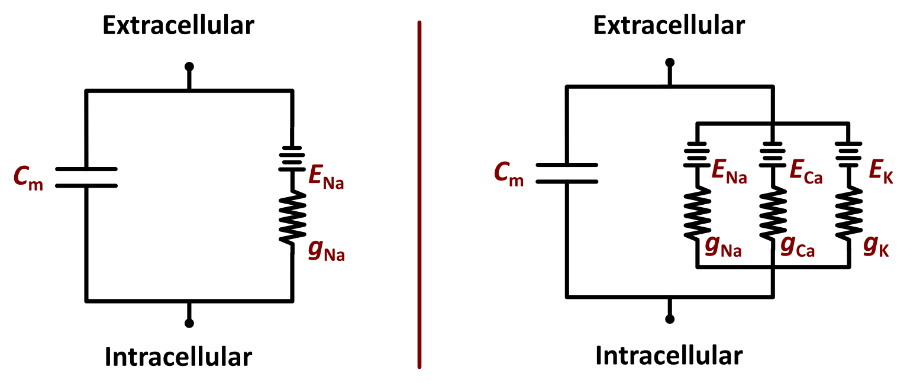
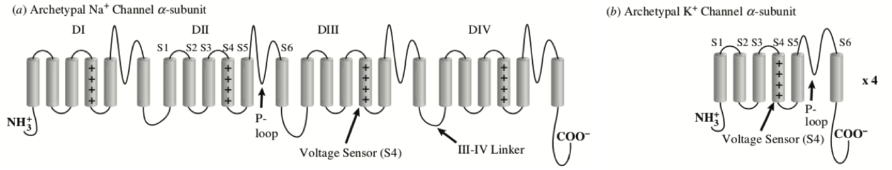
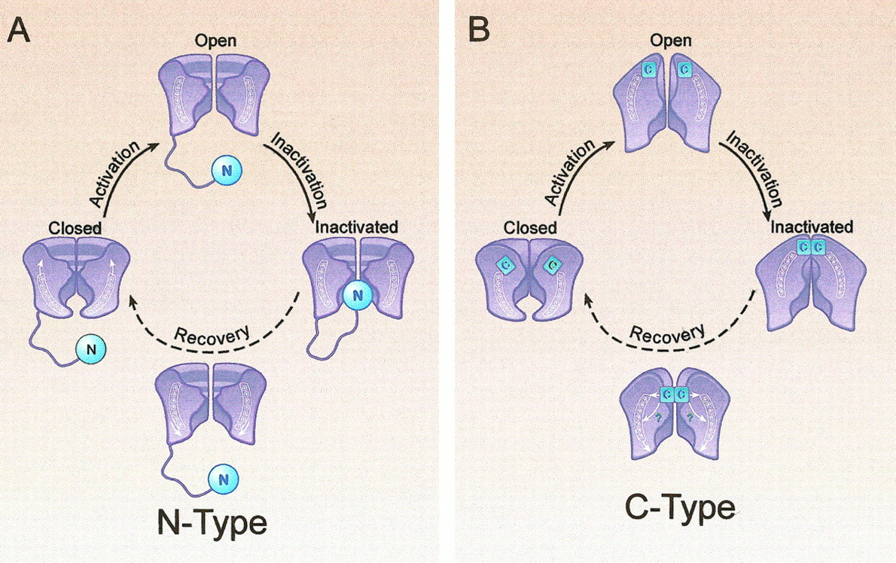
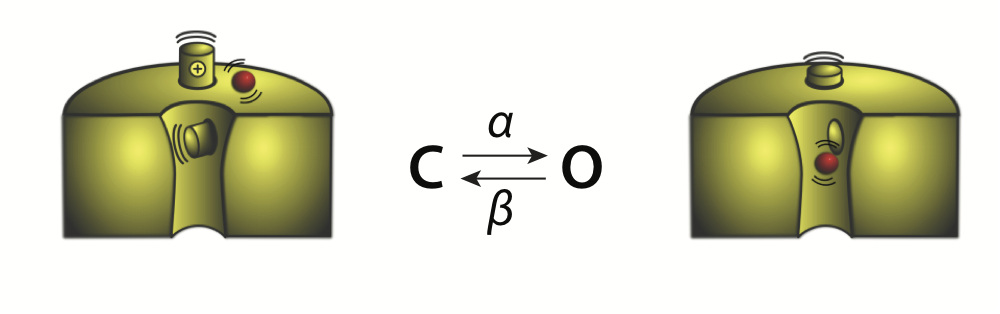
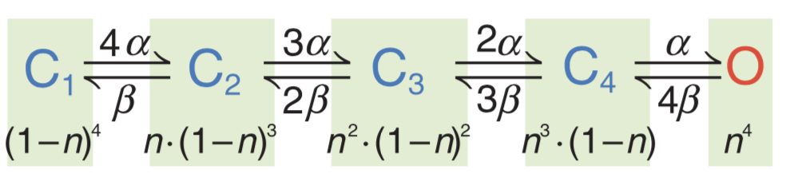
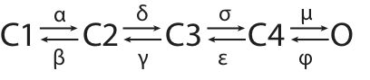

# L4 — Understanding modern ion current models

### Quick Review: 

By now you have many of the tools you will need to understand how to build models of ion currents.

First, you know that everything begins with the law of mass action. Specifically, you know that the rate at which a molecular process proceeds can be described by:
$$\mathrm{A}\overset{k}{\longrightarrow}\mathrm{B},  \qquad \frac{\rm dB}{\mathrm{d}t} = k\mathrm{A}.$$
You know that by considering the ratio of forward and reverse rates for any bidirectional reaction, it is possible to derive the proportion of molecules existing in each molecular state once the system has reached equilibrium or "steady state" ($\mathrm{d/d}t = \rm 0$). This proportion can be defined by the equilibrium constant ($K_{\rm eq}$):
$$\mathrm{A}{\underset{k_-}{\overset{k_+}{\rightleftharpoons}}B}, \qquad K_{\rm eq} = \frac{k_+}{k_-}.$$
You also know that this equilibrium constant is related to the free energy of the reaction or process:
$$K_{\rm eq} = \frac{{\rm [B]}}{{\rm [A]}} = e^{-\Delta _rG^0/RT}.$$
And so the free energy of reaction can also be expressed as a function of the equilibrium constant:
$$ \Delta _rG^0 = -RT(\ln{K_{\rm eq}}).$$
This becomes helpful when we start discussing the energy associated with ion channel gating.
 
 
In terms of membrane biophysics, you know that the cell membrane acts as a thin capacitor, and very steep gradients in charge (electric fields) and ionic concentration can be generated across it. The net charge separation across the membrane for all ions in solution is the membrane potential ($V=V*{\rm{i}}-V*{\rm{e}}$).

You know that this potential can provide the energy to drive flux across the membrane that can either be assisted or inhibited by diffusion depending on the concentration gradient for the species of ion in question. The net flux of that ion across the membrane, assuming no resistance other than bulk solution, can then be calculated by the Nernst-Planck equation in one dimension:

$$J = -D(\frac{{\rm d} c}{{\rm d} x} + \frac{zF}{RT}c\frac{{\rm d} V}{{\rm d} x}).$$

where $c$ is the concentration function for the ion in time and 1-D space $c(t,x)$.

You also know that when the diffusive and electrostatic effects are equal and opposite (at equilibrium), you know that we have the Nernst equilibrium potential for the ion:

$$E_{\rm ion} = \frac{RT}{zF} \ln \frac{c_{\rm e}}{c_{\rm i}}.$$

Finally, because each ion has a different Nernst potential, and because diffusion across the membrane is limited by ion transport proteins (mostly ion channels) rather than bulk diffusion, it is typical to model the electrical activity of the membrane as an RC circuit. You know that, in this context, the ion-specific currents are modelled as Ohmic conductors, and the complexities of electrodiffusion can be replaced simply by the difference between the membrane potential and the corresponding Nernst potential ($V-E_{\rm{ion}}$):

$I_{\rm tot} = I_{\rm cap} + I_{\rm Na}  \qquad\qquad\qquad\qquad \qquad I_{\rm tot} = I_{\rm cap} + I_{\rm ion} = I_{\rm cap} + I_{\rm Na} + I_{\rm K} + I_{\rm Ca}$ 

$ \qquad\qquad C*{\rm m}\frac{{\rm d}V}{{\rm d}t} = - g*{\rm Na} (V-E*{\rm Na}) \qquad\qquad\qquad C*{\rm m}\frac{{\rm d}V}{{\rm d}t} = -\big[g_{\rm Na} (V-E_{\rm Na}) + g_{\rm K} (V-E_{\rm K}) + g_{\rm Ca} (V-E_{\rm Ca})\big]$

### Topics in ion channel gating, and modelling ionic currents:

Today we will be filling in the details needed to model the ion channel function beyond these Ohmic representations of the currents. Some of the major questions we will ask are:

1. How do we build models to incorporate measurable function, but remain consistent with basic physical laws?

2. How do the molecular changes underlying ion channel function relate to the processes that we implement in models of ion currents?

3. What is the relationship between these processes and the dynamics of the membrane circuit?

4. How are modern data sources used to define the structure and parameters of ion current models?

5. Which ion currents are important for simulating the function of different electrically excitable cells and tissues?

Here we go!

## Structure-function relationships in ion channel gating

In general, our models of ion channel function are poorly linked to changes in molecular structure. Instead, they are most often built to represent measurable function. In part this is because measuring the physical states of channels is challenging. Below, we will discuss in some detail how ion channel function is measured, but first let's take a quick introduction to some basic structure-function relationships in ion channel biology.

We have an understanding of the structures that allow channels to be selectively permeable to certain ionic species - you read about the selectivity filter in the last lecture. We also have a relatively good idea of the regions that confer voltage-sensitivity, and the classes of structures capable of binding regulatory ionic ligands, such as calcium, and second messengers.

In this section we are interested in the molecular structures that permit or prevent opening of the major channel subtypes. We'll focus here on voltage-sensing in voltage-gated channels, for which the most important structures are shown below:

**(a)** typical voltage-gate $\rm{Na}^{+}$ channel alpha subunit structure. 
**(b)** typical voltage-gate $\rm{K}^{+}$ channel alpha subunit structure. 
[Figure adapted from Rudy and Silva. *Quart. Rev. Biophys.* 2006.]

### Essential aspects of channel structure

In the figure above, you can see the core ($\alpha$) subunits of the major voltage-gated cardiac $\rm{Na}^{+}$, $\rm{Ca}^{2+}$, and $\rm{K}^{+}$ channels. These are composed of either one ($\rm{K}^{+}$ channels) or four ($\rm{Na}^{+}$ and $\rm{Ca}^{2+}$ channels) transmembrane domains. Importantly or our modelling, each of these transmembrane domains contains one voltage sensor (VSD), which is a small stretch of (usually 4 or more) positively charged amino acids (often Arginines), which create a region of the protein that is very sensitive to membrane potential.

### ... and function

In trying to link structure to function in our models, we have to begin by understanding how function is characterised. It is conventional to describe the function of ion channels in terms of 4 experimentally measurable processes:

1. Activation (channel opening)
2. Deactivation (channel closure, reversal of activation)
3. Inactivation (channel closure, separate of activation and deactivation)
4. Recovery from inactivation (return to a state permissive of activation, the reversal of inactivation)

#### Activation and deactivation

Structural transitions of the voltage sensors underlie activation of voltage-gated channels. When membrane potential becomes more positive, the positive charges of the VSD are electrostatically drawn in an extrcellular direction, and this shift is somehow (still unclear for many channels) transferred to the channel pore to open it. This shift in charge as the VSD moves can be measured as a small capacitive current, which is called gating current.

For modelling, an important characteristic of this process is that it requires transition of all four voltage sensors to the open configuration before the pore will open. In voltage-gated $\rm{Na}^{+}$ and $\rm{Ca}^{2+}$ channels the four VSDs are all part of the same protein. For tetrameric (4-subunit) $\rm{K}^{+}$ channels, this must happen at the single VSDs present in each of the four $\alpha$ subunits.

Deactivation is the reverse process of activation. As membrane potential returns towards more negative values, the VSDs stochastically return to their internal configurations, and the channel closes.

#### Inactivation and recovery

From the perspective of channel structure, inactivation is a more varied process than activation. It is often depicted as a ball and chain mechanism shown in panel A of the below figure.

[Figure from Rasmusson et al. *Circ. Res.* 1998.]

This was the original form of inactivation established for the family of $\rm{K}^{+}$ channels that carries the cardiac transient outward current $I_{\mathrm{to}}$, which we will cover in more detail later. It was called N-type inactivation because it can be removed by truncating the protein at its N-terminal. An important and pronounced characteristic of this type of inactivation, is that it first relies upon activation. This means that the process of activation and inactivation are intrinsically linked, and cannot be considered independent. We'll return to this issue shortly. For the moment, it suffices to note that there are other types of voltage-dependent inactivation. In particular, C-type inactivation of $\rm{K}^{+}$ channels result from structural changes to the channel pore.

Unlike N- and C-type inactivation, $\rm{Na}^{+}$ channel inactivation revolves around the intracellular linker region between TMDs 3 and 4, where particular amino acid sequences are essential for normal inactivation. This is also a very fast form of inactivation.

As we'll see later, there are other ways that channels can be opened and inactivated, and there are other ionic mechanisms that can change channel permeability without causing known structural changes. We will cover the important ones when we get to discussing the relevant channels.

## Modelling molecular transitions as processes

To incorporate activation, deactivation, and inactivation. We start with our Ohmic model of an ion current carried by a population of channels (x):
$$ I*{{\rm x}} = g*{{\rm x}}(V - E\_{{\rm x}}).$$

Importantly, the units of $g_{{\rm x}}$ here are normalized to the membrane capacitance $mS/\mu{}F$. So this term therefore represents the summed conductance of all the channels in a 1 $\mu{}F$ patch of membrane. We can also express the conductance explicitly in terms of the number of channels:

$$ g*{\rm{x}} = N*{\rm{x}}P*{\rm{o}}G*{\rm{x}}. $$

Where $N{{\rm x}}$ is the number of channels in the membrane patch, $P_{{\rm o}}$ is the open probability and represents the fraction of channels that are open, and $G_{{\rm x}}$ is the conductance of a single channel (usually in pS). Because both $N_{{\rm x}}$ and $G_{{\rm x}}$ are constants, it is only $P_{{\rm o}}$ that represents the function of the channel itself. In this term we attempt to capture all the voltage- and time-dependence we can measure functionally.

Let's start by trying to capture the most simple properties. We have to model the changes to $P_{{\rm o}}$, which result from the gating processes described above. These are generally represented as time- and voltage-dependent mass action reactions. We'll start by modelling activation, and assume that it occurs due to a single molecular transition as shown below:

Applying mass action, we can define a very simple process:

$$\frac{{\rm dO}}{{\rm d}t} = \alpha \rm{[C]}-\beta \rm{[O]}.$$

Because this conventional mass action expression provides C and O as concentrations, we can divide by the total concentration ([C]+[O]) to give each state as a probability. We can then define the equation just in terms of the open state:

$$\frac{\rm{dP_o}}{{\rm d}t} = \alpha (1-\rm{P_o})-\beta \rm{P_o}.$$

Becuase this process typically involves transition of 4 VSDs. If we assume that each VSD is identical and unaffected by all others (i.e. that it is independent), then open probability will be the product of the probability of all four transitions, each of which proceeds at the rate of the single transition. So, if we call the gating transition variable $n$:

$$ {\rm P\_{o}} = n^4, \qquad\qquad {\rm where:} \frac{{\rm d}n}{{\rm d}t} = \alpha (1-n)-\beta n.$$

Now our current equation has become:

$$ I*{{\rm x}} = g*{{\rm x}}n^{4}_{x}(V - E_{{\rm x}}).$$

For clarity, here: $g_{{\rm x}} = N_{\rm{x}}G_{\rm{x}}$

### Voltage dependent rate constants:

In the exercises for this lecture you will use some analytic approaches to explore the dynamics of these gating functions. So far we have only considered them as constants, but most are in fact strongly dependent on voltage, and this is necessary to achieve a voltage-dependent activation process. There are many ways to model this voltage-dependence, but here we'll briefly introduce two common formulations.

First, a common means of describing the voltage dependence of current activation is to fit it to a Boltzmann equation:

$$ P*{o} = \frac{1}{1+e^{q(V*{1/2}-V)}}.$$

This expression is commonly used because it includes $V_{1/2}$ as a parameter (the potential at half-maximal activation), which is readily measurable from experiments. It is also biophysically attractive because it is derived by relating the equilibrium constant of steady-state open probability, to the free energy associated with movement of the gating charge ($q$, the VSD) through the membrane. So it provides a constraint for the relation of forward and backward rates:

$$ K*{eq} = \frac{\alpha}{\beta} = \frac{P*{o}}{P\_{c}} = e^{-\Delta \_rG^0/RT}\cdot{}e^{qV}.$$

Where $\Delta _rG^0$ is the equilibrium free energy of voltage-independent transition (the energy for moving the gating charges on the VSD in the absence of any electrical field), and $e^{qV}$ accounts for the electrostatic force provided by V acting on the charge (q).

To arrive at the Boltzmann equation, we first have to rewrite $e^{-\Delta _rG^0/RT}$ as $e^{-qFV_{1/2}}$, which allows:

$$ P*{o} = \frac{P*{o}}{P*{o}+P*{c}} = \frac{1}{1+P*{c}/P*{o}} = \frac{1}{1+e^{q(V\_{1/2}-V)}}.$$

Simpler relationships are then often used to prescribe voltage dependence to $\alpha$, and $\beta$. In lecture 4 you will check the properties of:

$$ \alpha(V) = e^{(V-V*\alpha)/d*\alpha}$$

In this formulation, $V_\alpha$ represents the potential at which $\alpha = 1$, and $d_{\alpha}$ is often referred to as "slope factor" as it determines the steepness of the voltage-depdendence of the rate. It's worth noting that many behaviours can also be captured by even simpler exponential relationships. For example:

$$ \alpha(V) = Ae^{kV}$$

### Markov-state models

In the case that there are multiple non-identical or non-independent transitions in the activation process, we need to specify a model where each transition is defined differently. This approach has become popular as more details of channel gating have been found or hypothesized. This general class of modelling has been called Markov-state modelling as it treats the evolution of channel configuration as a continuous-time Markov process. The formulations described above are also Markov models, just a specific subclass where each transition in the $m$ and $h$ processes are independent and identical. Models of this subtype are commonly called Hodgkin-Huxley (HH) formulations. An example of a equivalent Markov and HH potassium channel models is shown below:

[Figure from Rudy and Silva. *Quart. Rev. Biophys.* 2006.]

If we now consider the transitions of voltage sensors to be dependent on the states of the others, we can define different rates for each transition in the sequence:

And now we have a larger set of ODE's to solve:

$$\frac{{\rm dC1}}{{\rm d}t} = \beta \rm{C2}-\alpha \rm{C1}.$$
$$\frac{{\rm dC2}}{{\rm d}t} = \alpha \rm{C1}+\gamma \rm{C3}-\rm{C2}(\beta+\delta).$$
$$\frac{{\rm dC3}}{{\rm d}t} = \delta \rm{C2}+ \epsilon \rm{C4}-\rm{C3}(\gamma+\sigma).$$
$$\frac{{\rm dC4}}{{\rm d}t} = \sigma \rm{C3}+ \phi \rm{O} - \rm{C4}(\epsilon+\mu).$$

with mass conservation:

$$\rm{O} = 1-(\rm{C1}+\rm{C2}+\rm{C3}+\rm{C4})$$

### Strengths and weaknesses of Markovian formulations

The additional flexibility, and the ability to construct less abstract representations of the biophysics underlying channel gating, are two major reasons that Markov models have become popular in cardiac modelling. However, the extra complexity introduced in these models brings with it difficulties in model identification (parameterization), interpretation, analysis, and computation.

The simple framework is to begin by modifying the current equation above to incorporate these processes. In general terms, for our current ($I_{\rm{x}}$, $A/F$), which exhibits both activation ($m_{\rm{x}}$, dimensionless) and inactivation ($h_{{\rm x}}$, dimensionless), this becomes:

$ I*{\rm{x}} = {g*{\rm{x}}}m*{{\rm x}}h*{\rm{x}}(V - E\_{\rm{x}}).$

Where, in your earlier discussions:  

$\frac{{\rm d}m_{\rm{x}}}{{\rm d}t} = \alpha_{{\rm m}}(1-m_{\rm{x}})-\beta_{{\rm m}}m_{\rm{x}}.$

$\frac{{\rm d}h_{\rm{x}}}{{\rm d}t} = \alpha_{{\rm h}}(1-h_{\rm{x}})-\beta_{{\rm h}}h_{\rm{x}}.$
