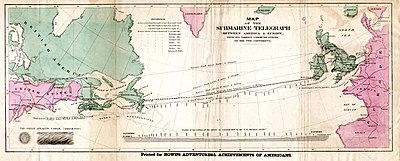
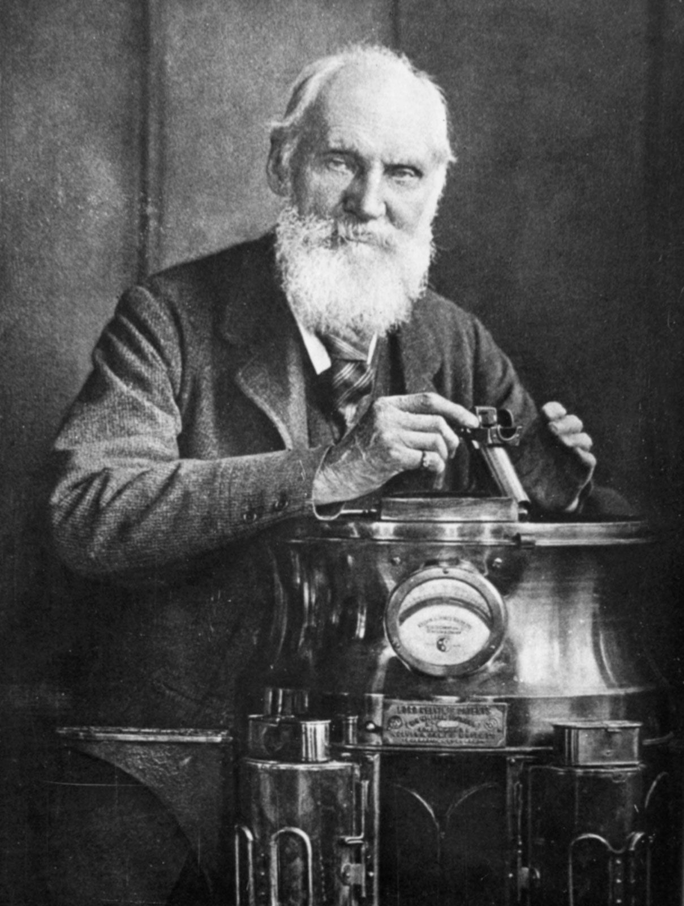
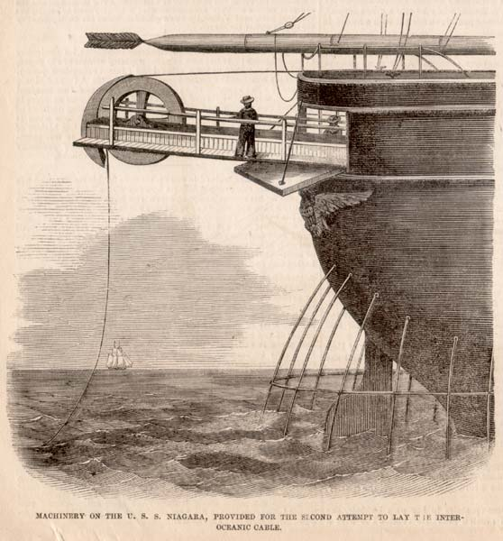
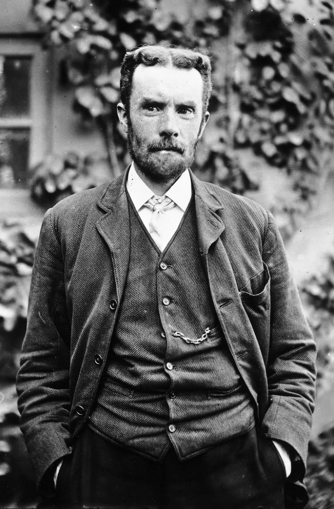
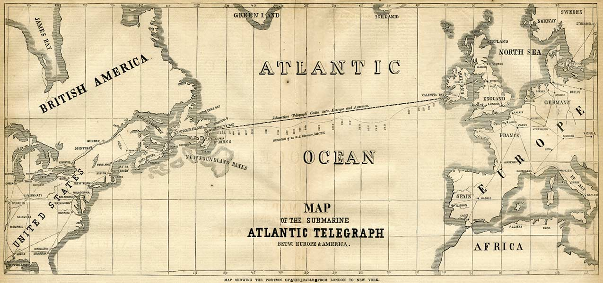
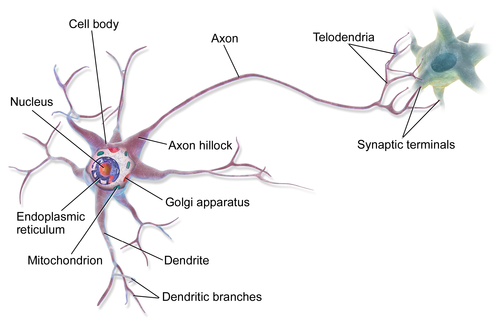
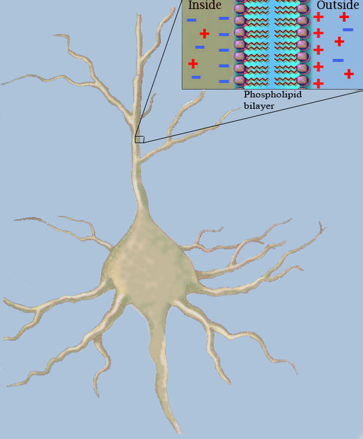
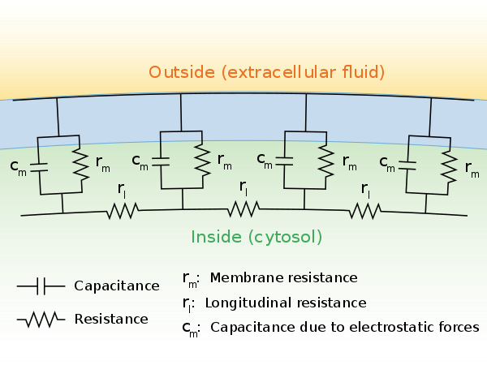
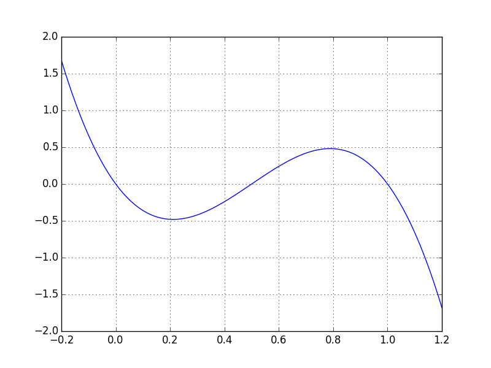

[L07 Cable Equation]

<!-- dom:TITLE: Conduction in excitable cells - the cable equation -->

# Conduction in excitable cells - the cable equation

<!-- dom:AUTHOR: Joakim Sundnes/Molly Maleckar  -->
<!-- Author: -->

**Molly Maleckar**

Date: **June 18th, 2025**

## This morning's schedule, roughly:

- 9~9:15 - introductions (this benefits chiefly Giulia and myself...)

- 9:15-10:00 - Lecture 07: the cable equation and related topics

- 10:00~10:30 - Coffee/stretch/discussion break

- 10:30~11:15 - "Lab work" with Lecture 08: running the bistable equation and beyond to cardiac modeling

- 11:15~12:00 - Coffee/stretch/discussion, break early for lunch if desired

## Outline

- Introduction
  - History

  - Brief overview of neurons

- Derivation of the cable equation

- Scaling/dimensionless form

- Example models

## We will use it to describe signal conduction in neurons, but there's a reason it is called the cable equation...

<!-- dom:FIGURE: [./figs/atlantic_cable1.jpg, width=800 frac=1.0] -->
<!-- begin figure -->

<!-- end figure -->

<!-- FIGURE: [./figs/atlantic_cable2, width=500 frac=1.0] -->

# Cable Equation and Cable Theory: Historical Development

---

**From Telegraph Lines to Modern Transmission Theory**

Mathematical foundations that emerged from 19th-century telecommunications and shaped our understanding of signal propagation.
_This presentation covers the historical development from Lord Kelvin's early work through Heaviside's contributions to modern applications in computational biology._

---

### Key Historical Figures

**Lord Kelvin (1850s)**  
Early diffusion models for submarine telegraph cables

**Oliver Heaviside (Late 1870s)**  
Advanced transmission line theory and wave propagation

---

# Early Diffusion Models (1850s)

## Lord Kelvin's Work

**William Thomson (1824-1907, later Lord Kelvin)** developed the first mathematical model to understand signal behavior in submarine telegraph cables.

### The Diffusion Approach

- Modeled signal propagation as a diffusion process, similar to heat conduction
- Applied mathematical techniques from heat transfer theory
- Focused on understanding signal attenuation over distance

### Observed Limitations

- Could not fully explain observed delays and signal degradation in long cables
- Model predictions didn't match experimental results for transatlantic cables
- Missing key physical phenomena in signal transmission

### Historical Context

The first transatlantic telegraph cable attempts were driving the need for better understanding of signal transmission over long distances.

---

_Early submarine telegraph cable laying operations_

---

# Heaviside's Contribution (Late 1870s)

## Advanced Transmission Line Theory

**Oliver Heaviside** (1850-1925) began his work on transmission line theory, advancing our understanding of signal propagation.

### Wave Propagation Theory

Introduced the concept that signals don't just diffuse but also travel as waves along transmission lines.

**Key Insight:** Combined diffusion and wave propagation effects to create a more complete model of signal transmission.

### Beyond Kelvin's Model

Advanced understanding by recognizing the dual nature of signal propagation on transmission lines.

| Kelvin's Approach     | Heaviside's Approach        |
| --------------------- | --------------------------- |
| Diffusion Only        | Diffusion + Waves           |
| Heat equation analogy | Electromagnetic wave theory |
| Limited accuracy      | Improved predictions        |

---

### Theoretical Advancement

Heaviside's work represented a significant step forward in understanding electromagnetic signal propagation, moving beyond the purely diffusive models to incorporate wave-like behavior.

# The Telegrapher's Equations: Heaviside's Mathematical Framework

### Mathematical Description

These equations describe both the spatial and temporal evolution of voltage and current, capturing the wave-like nature of signal propagation.

### Partial Differential Equations

**Voltage Equation:**
$$\frac{\partial V}{\partial x} = -R \cdot I - L \frac{\partial I}{\partial t}$$

**Current Equation:**
$$\frac{\partial I}{\partial x} = -G \cdot V - C \frac{\partial V}{\partial t}$$

# The Telegrapher's Equations: Heaviside's Mathematical Framework

## Line Parameters

| Parameter | Description                 |
| --------- | --------------------------- |
| **R**     | Resistance per unit length  |
| **L**     | Inductance per unit length  |
| **C**     | Capacitance per unit length |
| **G**     | Conductance per unit length |

## Variables

| Variable | Description                                     |
| -------- | ----------------------------------------------- |
| **V**    | Voltage - Function of position (x) and time (t) |
| **I**    | Current - Function of position (x) and time (t) |

---

# The Telegrapher's Equations: Heaviside's Mathematical Framework

### Wave Equation Form

Combining the equations yields:

$$\frac{\partial^2 V}{\partial x^2} = LC \frac{\partial^2 V}{\partial t^2} + (RC + LG) \frac{\partial V}{\partial t} + RG \cdot V$$

# Significance and Impact

### Theoretical Foundation

Provided mathematical foundation for understanding signal propagation in various transmission line applications...
And beyond!

### Extended Applications

Extended beyond telegraph cables to radio frequency conductors, power lines, and other transmission systems.

---

_Historical map showing the submarine cable networks that benefited from theoretical advances in transmission line theory_

---

# Contemporary Relevance in Technology

### Computational Biology

Similar frameworks apply to signal propagation in neural networks and bioelectrical systems.

**Applications:** Neural signal transmission, bioelectric field analysis, action potential modeling

### Modern Technologies

- **5G Networks:** Signal propagation in high-frequency systems
- **Data Centers:** High-speed interconnects and signal integrity
- **Satellite Communications:** RF transmission line analysis

### Continued Relevance

From 19th-century telegraph cables to modern quantum communication, the mathematical principles remain applicable.

---

# Summary

The mathematical principles established for understanding signal propagation continue to be fundamental to modern transmission line analysis and design.

### Key Applications Today:

1. **Telecommunications:** Fiber optics, wireless systems, satellite communications
2. **Power Engineering:** Grid analysis, transmission line design
3. **Computational Biology:** **Neural signal modeling, bioelectrical systems**
4. **Electronics:** High-speed digital design, signal integrity analysis

---

### Now pivoting: applications in neurobiology and beyond!

<!-- dom:FIGURE: [./figs/250.png, width=1000 frac=2.0] -->
<!-- begin figure -->

<!-- end figure -->

Image from Wikipedia (https://en.wikipedia.org/wiki/Neuron)

## Neurons consist of three distinct parts

- Dendrite-tree, the "input stage" of the neuron, converges on the soma.

- Soma, the cell body, contains the "normal" cellular functions

- Axon, the output of the neuron, may be branched. Synapses at the ends are connected to neighboring dendrites.

**Active vs passive.**

- Axons are excitable => active conduction

- Dendrites are non-excitable => passive conduction

<!-- dom:FIGURE: [./figs/250.png, width=1000 frac=2.0] -->
<!-- begin figure -->

<!-- end figure -->

Image from Wikipedia (https://en.wikipedia.org/wiki/Cable_theory)

## Why is the cable equation important?

- Fundamental for modeling neurons

- Signal propagation in Purkinje network

- Extends to cardiac conduction in 3D (bidomain, monodomain)

## Fundamental quantities and assumptions

The cell typically has a potential gradient along its length. Radial components will be ignored.
Notation:

- $V_i$ and $V_e$ are intra- and extracellular potentials

- $I_i$ and $I_e$ are intra- and extracellular (axial) current

- $r_i$ and $r_e$; intra- and extracellular resistance per unit length

We have

$$
r_i = \frac{R_c}{A_i},
$$

where $R_c$ is the cytoplasmic resistivity and $A_i$ is the cross sectional area of the cable.

## Sketch of a discrete cable

<!-- dom:FIGURE: [./figs/251.png, width=800 frac=0.9] -->
<!-- begin figure -->

<!-- end figure -->

## Currents are assumed to be Ohmic

The current along the axon is proportional to the potential difference:

$$
\begin{align*}
V_i(x+\Delta x) - V_i(x) &= - I_i(x) r_i \Delta x \\
V_e(x+\Delta x) - V_e(x) &= - I_e(x) r_e \Delta x
\end{align*}
$$

In the limit:

$$
\begin{align*}
I_i = - \frac{1}{r_i}  \frac{\partial V_i}{\partial x} \\
I_e = - \frac{1}{r_e}  \frac{\partial V_e}{\partial x}
\end{align*}
$$

## Conservation of current (1)

Any current leaving the intracellular domain has to enter the
extracellular domain, and vice-versa. Total current is conserved
between $x$ and $x+\Delta x$:

$$
I_i(x) - I_i(x+\Delta x) = -(I_e(x) -  I_e(x+\Delta x)) = I_t \Delta x
$$

where $I_t$ is transmembrane current, per unit length.

Taking the limit $\Delta x\rightarrow 0$ yields

$$
I_t = - \frac{\partial I_i}{\partial x} = \frac{\partial I_e}{\partial x}
$$

Inserting the expression for the currents ($I_{i,e} = (-1/r_{i,e}) \partial V_{i,e}/\partial x$) gives

$$
I_t = \frac{1}{r_i}  \frac{\partial^2 V_i}{\partial x^2}  = -\frac{1}{r_e} \frac{\partial^2 V_e}{\partial x^2}
$$

## Conservation of current (2)

We now have the membrane current $I_t$ expressed in terms of
$I_i,I_e$ (and $V_i,V_e$).

We want a relation between the $I_t$ and the membrane
potential $V$:

$$
\frac{1}{r_e}  \frac{\partial^2 V_e}{\partial x^2} =  - \frac{1}{r_i}
\frac{\partial^2 V_i}{\partial x^2} =  - \frac{1}{r_i} (  \frac{\partial^2 V}{\partial x^2}+ \frac{\partial^2 V_e}{\partial x^2})
$$

$$
(\frac{1}{r_e}+ \frac{1}{r_i}) \frac{\partial^2 V_e}{\partial x^2} =  - \frac{1}{r_i}  \frac{\partial^2 V}{\partial x^2}
$$

## Conservation of current (3)

cont.

$$
(\frac{1}{r_e}+ \frac{1}{r_i}) \frac{\partial^2 V_e}{\partial x^2} =  - \frac{1}{r_i}  \frac{\partial^2 V}{\partial x^2}
$$

$$
\frac{\partial^2 V_e}{\partial x^2} = - \frac{ \frac{1}{r_i} }{\frac{1}{r_e}+ \frac{1}{r_i}} \frac{\partial^2 V}{\partial x^2} =-\frac{r_e}{r_e+r_i}\frac{\partial^2 V}{\partial x^2}
$$

so

$$
I_t = \frac{\partial I_e}{\partial x} =  -  \frac{1}{r_e}  \frac{\partial^2 V_e}{\partial x^2}=   \frac{1}{r_e+r_i}\frac{\partial^2 V}{\partial x^2}
$$

## Incorporating cell membrane physiology

From the membrane model previously derived we have

$$
I_t = p(C_m\frac{\partial V}{\partial t}+I_{ion})
$$

where $p$ is the circumference of the cable.
The total 1D cable model is then:

$$
p(C_m\frac{\partial V}{\partial t} +I_{ion}(V))= (\frac{1}{r_e+r_i} \frac{\partial^2 V}{\partial x^2})
$$

## Physical units

So far we have not considered the physical units of the terms. Typical
units are

<table border="1">
<thead>
<tr><th align="left">  Quantity </th> <th align="left"> Dimension  </th> <th align="left">  Typical unit  </th> </tr>
</thead>
<tbody>
<tr><td align="right">   $p$            </td> <td align="right">   length          </td> <td align="right">   $cm$                </td> </tr>
<tr><td align="right">   $C_m$          </td> <td align="right">   capac./area     </td> <td align="right">   $\mu F/cm ^2$       </td> </tr>
<tr><td align="right">   V              </td> <td align="right">   voltage         </td> <td align="right">   $mV$                </td> </tr>
<tr><td align="right">   $I_{ion}$      </td> <td align="right">   current/area    </td> <td align="right">   $\mu A/cm^2$        </td> </tr>
<tr><td align="right">   $r_i , r_e$    </td> <td align="right">   res./length     </td> <td align="right">   $10^3\Omega /cm$    </td> </tr>
<tr><td align="right">   $x$            </td> <td align="right">   length          </td> <td align="right">   $cm$                </td> </tr>
<tr><td align="right">   $t$            </td> <td align="right">   time            </td> <td align="right">   $ms$                </td> </tr>
</tbody>
</table>

## Exercise

Verify that all the terms in the cable equation have the same physical
units:

$$
p(C_m\frac{\partial V}{\partial t} +I_{ion}(V))= (\frac{1}{r_e+r_i} \frac{\partial^2 V}{\partial x^2})
$$

<table border="1">
<thead>
<tr><th align="left">  Quantity </th> <th align="left"> Dimension  </th> <th align="left">  Typical unit  </th> </tr>
</thead>
<tbody>
<tr><td align="right">   $p$            </td> <td align="right">   length          </td> <td align="right">   $cm$                </td> </tr>
<tr><td align="right">   $C_m$          </td> <td align="right">   capac./area     </td> <td align="right">   $\mu F/cm ^2$       </td> </tr>
<tr><td align="right">   V              </td> <td align="right">   voltage         </td> <td align="right">   $mV$                </td> </tr>
<tr><td align="right">   $I_{ion}$      </td> <td align="right">   current/area    </td> <td align="right">   $\mu A/cm^2$        </td> </tr>
<tr><td align="right">   $r_i , r_e$    </td> <td align="right">   res./length     </td> <td align="right">   $10^3\Omega /cm$    </td> </tr>
<tr><td align="right">   $x$            </td> <td align="right">   length          </td> <td align="right">   $cm$                </td> </tr>
<tr><td align="right">   $t$            </td> <td align="right">   time            </td> <td align="right">   $ms$                </td> </tr>
</tbody>
</table>
What is the unit of the terms in the equation?

## Scaling the cable equation (1)

We can scale the variables to reduce the number of parameters.
Define a membrane resistance:

$$
\frac{1}{R_m} = \frac{\Delta I_{ion}}{\Delta V}(V_0)
$$

where $V_0$ is the resting potential. Multiply with $R_m$ to get

$$
C_m R_m \frac{\partial V}{\partial t} + R_m I_{ion}=
\frac{R_m}{p(r_i+r_e)}\frac{\partial^2 V}{\partial x^2}
$$

Here we have assumed $r_i$ and $r_e$ constant.

## Scaling the cable equation (2)

Defining $f=-R_m I_{ion}$, $\tau_m=C_m R_m$ (time constant)
and $\lambda_m^2 = R_m/(p(r_i+r_e))$ (space constant squared)
we can write

$$
\tau_m \frac{\partial V}{\partial t} - f=\lambda_m^2 \frac{\partial^2
V}{\partial x^2}
$$

## Scaling the cable equation (3)

We introduce the dimensionless variables:

$$
T = t/\tau_m, X = x/\lambda_m
$$

We can then write:

<!-- Equation labels as ordinary links -->

$$
\frac{\partial V}{\partial T} = f + \frac{\partial^2 V}{\partial X^2} \label{scaled} \tag{1}
$$

A solution $\hat{V}(T,X)$ of ([1](#scaled)) implies that
$V(t,x) = \hat{V}(t/\tau_m,x/\lambda_m)$ will satisfy the unscaled
equation.

The scaled equation has units of voltage, but can easily be
non-dimensionalized by introducing $V=V_0+\bar{V}\tilde{V}$, where
$V_0$ is the resting membrane voltage, $\bar{V}$ is a characteristic voltage, and $\tilde{V}$ is a
dimensionless variable.

## The reaction term

- The form of $f$ depends on the cell type, or which part of the cell, we want to study.

- For the axon $I_{ion}(m,n,h,V)$ of the HH-model is a good candidate.

- For the dendrite, which is non-excitable, a linear resistance model is good:

$$
I_{ion} = \frac{1}{R_m}(V-V_0)
$$

or in scaled form $f = -V$:

$$
\frac{\partial V}{\partial T} = \frac{\partial^2 V}{\partial X^2} - V
$$

## Boundary- and initial conditions (1)

Initial condition examples:

- Entire cable at rest: $V(X,0) = 0$

- Partly activated (piecewise constant):
  $$
  V(X,0) = 0, x < x_0 \\
  V(X,0) = V_0, x > x_0
  $$

## Boundary- and initial conditions (2)

Types of boundary conditions:

- Dirichlet: $V(x_b,T) = V_b$, voltage clamp.

- Neumann: $\frac{\partial V}{\partial X} = -r_i \lambda_m I$, current injection.

Justification:

$$
\frac{\partial V_i}{\partial x}= -r_i I_i \Rightarrow
\frac{\partial V }{\partial x} - \frac{\partial V_e}{\partial x} = -r_i I_i
\stackrel{r_e=0}{\Longrightarrow} \frac{\partial V }{\partial x}= -r_i I_i
$$

## Passive conduction

The linear cable in dimensionless form

$$
\frac{\partial V}{\partial T} = \frac{\partial^2 V}{\partial X^2} - V
$$

We consider a semi-infinite (i.e., long) cable with voltage clamped
to a constant $V_c$ at $X = 0$. At steady state, we have

$$
\frac{\partial^2 V}{\partial X^2} = V
$$

with solution

$$
V = V_c e^{-X} = V_c e^{-x/\lambda_m}
$$

What does this tell you about how a signal decays along the cable? How
strong is the signal one space constant from the source? How about ten
space constants?

## Exercise

Remember the expression for the space constant:

$$
\lambda_m = \sqrt{R_m/(p(r_i +r_e))}\approx\sqrt{R_m/(p r_i)} = \sqrt{R_m/(pR_c/A)},
$$

Assume a circular cross section with diameter $d$. Typical values for
a mammalian neuron are $R_m = 7000\Omega
\textrm{cm}^2, R_c = 150\Omega \textrm{cm}, d = 10.0\mu m$

Calculate the space constant $\lambda_m$. How does it compare to the length of a
human axon?

## The bistable equation (1)

The simplest model of active conduction in neuron is obtained by choosing the reaction term

$$
f(V)=AV(1-V)(V-\alpha),
$$

where $\alpha$ is a parameter between 0 and 1, and $A$ is a scaling parameter
for the reaction term.

## The bistable equation (2)

We have

$$
\frac{\partial V}{\partial t} = \frac{\partial^2 V}{\partial x^2} +AV(1-V)(V-\alpha),
$$

and if we neglect the diffusion term we get

$$
\frac{\partial V}{\partial t} = AV(1-V)(V -\alpha).
$$

The right hand side has three zeros; $V = 0,V = 1,V = \alpha$. These are
equilibrium points for the equation ($\partial V/\partial t = 0$).

## The bistable equation (3)

<!-- dom:FIGURE: [./figs/cubic.png, width=300 frac=0.7] -->
<!-- begin figure -->

<!-- end figure -->

Here $\alpha = 0.5$. What happens if the solution is perturbed away from the
three equilibrium points $V = 0, V = 1, V = \alpha$? (Recall that $dV/dt = f(V)$)

## The bistable equation (4)

- The equation has one unstable and two stable equilibrium points

- Any initial condition $V < \alpha$ will approach $V = 0$

- Any initial condition $V > \alpha$ will approach $V = 1$

In 1D (with diffusion), the solution is a traveling front.

## The FitzHugh-Nagumo model (1)

- The bistable equation describes a traveling front, but never returns to the resting potential

- To describe a propagating action potential we need to add a _recovery variable_

- The result is the FitzHugh-Nagumo (FHN) model, the simplest model for qualitatively realistic propagation in excitable cells

$$
\begin{align*}
\frac{\partial V}{\partial t} &= \frac{\partial^2 V}{\partial x^2}
+ AV(1-V)(V-\alpha) - w, \\
\frac{\partial w}{\partial t} &= \epsilon (V-\gamma w),
\end{align*}
$$

with $\epsilon,\gamma >0$ and $w(0,x) = 0$.

## The FitzHugh-Nagumo model (2)

Again, we can examine the behavior of the model by neglecting
diffusion:

$$
\begin{align*}
\frac{\partial V}{\partial t} &= AV(1-V)(V-\alpha) - w, \\
\frac{\partial w}{\partial t} &= \epsilon (V-\gamma w),
\end{align*}
$$

- Initially, the model behaves as the bistable equation

- As $V$ increases, $\frac{\partial w}{\partial t} >0$

- $w > 0 $ will "pull" $V$ back towards $V= 0$

- In 1D, the solution is a traveling wave resembling an action potential

## Summary

- The cable equation describes signal propagation in _leaky_ cables

- 1D reaction-diffusion equation, **the form of the reaction term depends on the application** (properties of the membrane):
  - Linear; passive membrane

  - Cubic; bistable equation (propagating front)

  - FHN; coupled to ODE (propagating AP)

  - Hodgkin-Huxley, cardiac cell models, etc...
